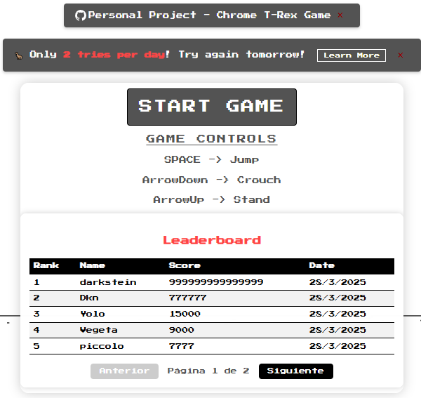
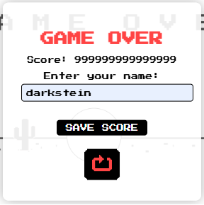
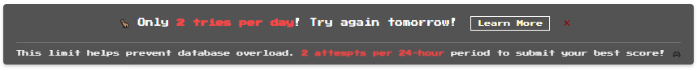
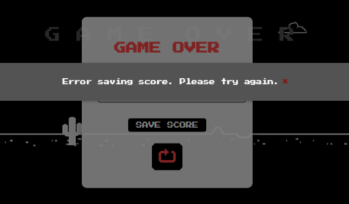
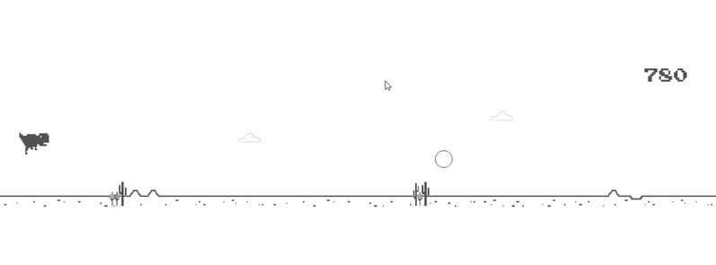

# 🦖 Chrome T-Rex Game

A modern implementation of the classic Chrome offline dinosaur game, built with vanilla JavaScript and HTML5 Canvas. Experience the nostalgia of the original game with enhanced features and improved gameplay mechanics.

## Live Demo 🎮
[Play the game](https://dinosaur-game-7f7ee-dcb30.web.app/)

#### Or download Pre-built Executable, built with Electron
- [](https://www.dropbox.com/scl/fi/iwdvn7dwsvbk7b8gcqiek/Chrome-T-Rex-Setup-1.0.0.zip?rlkey=pbcd0rvxdpcbvyii959sv1cdd&st=t5uimbpl&dl=0)
- [](https://drive.google.com/file/d/1SuCfyyUWQJYVspu6RIjSCgoVGKnvDYDJ/view?usp=sharing)

<div align="center">

> 🔒 Both executables have been verified virus-free by VirusTotal.

</div>

## Overview 🎮

This project recreates the iconic Chrome dinosaur game that appears when you're offline. While maintaining the core gameplay, it introduces several improvements and additional features to enhance the gaming experience.

### Technologies Used 🛠️
- **Frontend**: HTML5, CSS3, Vanilla JavaScript
- **Game Engine**: HTML5 Canvas
- **Database**: Firebase Firestore
- **Authentication**: Firebase Authentication
- **Hosting**: Firebase Hosting
- **Desktop App**: Electron
- **Version Control**: Git

### Key Features ⭐
- **Meteorite Obstacles**: Special falling obstacles that add an extra layer of challenge while being easy to avoid 🌠
- **Pterodactyl Encounters**: Flying obstacles that appear at higher scores, adding variety and increasing difficulty 🦅

<div align="center">

#### 🌠 Meteorites & Pterodactyls 🦅


</div>

- **Daily Challenge System**: Limited to 2 attempts per 24-hour period ⏰
- **Real-time Leaderboard**: Track and compare scores with other players 🏆
- **Dynamic Day/Night Cycle**: Visual changes based on score progression 🌓
- **Progressive Difficulty**: Increasing game speed and obstacle complexity 🚀
- **Desktop Application**: Available as a standalone .exe file 💻

## Game Mechanics 🎯

### Speed Progression ⚡
- Base speed increases at scores: 600, 2500, and 4000
- Pterodactyls (flying obstacles) appear at score 1000 🦅
- Pterodactyl frequency and speed increase at score 2500

### Day/Night Cycle 🌓
- Night mode activates every 1000 points 🌙
- Day mode occurs at 2000 points (excluding 1000-point intervals) ☀️
- Visual environment changes to reflect the time of day

### Controls ⌨️
```
SPACE      → Jump 🦘
ArrowDown  → Crouch ⬇️
ArrowUp    → Stand ⬆️
```

## Live Demo 🎮
[Play the game](https://dinosaur-game-7f7ee-dcb30.web.app/)

## Installation 🛠️

### Web Version 🌐
1. Clone the repository:
   ```bash
   git clone https://github.com/AitorSantaeugenia/chrome-t-rex-game
   ```
2. Configure environment:
   - Copy `.env.example` to `.env`
   - Update email configuration in `.env`
3. Configure game settings:
   - Copy `config.example.js` to `config.js`
   - Adjust game parameters as needed
4. Configure game settings:
   - Copy `config.example.json` to `config.json`
   - Adjust game parameters as needed
5. Launch the game:
   - Open `index.html` in your preferred browser

#### Deploy to Firebase Hosting
1. Install Firebase CLI:
   ```bash
   npm install -g firebase-tools
   ```
2. Login to Firebase:
   ```bash
   firebase login
   ```
3. Initialize Firebase in your project:
   ```bash
   firebase init
   ```
4. Build the web version:
   ```bash
   npm run web:build
   ```
5. Deploy to Firebase:
   ```bash
   npm run web:deploy
   ```

### Desktop Version 💻

#### Option 1: Download Pre-built Executable
- [](https://www.dropbox.com/scl/fi/iwdvn7dwsvbk7b8gcqiek/Chrome-T-Rex-Setup-1.0.0.zip?rlkey=pbcd0rvxdpcbvyii959sv1cdd&st=t5uimbpl&dl=0)
- [](https://drive.google.com/file/d/1SuCfyyUWQJYVspu6RIjSCgoVGKnvDYDJ/view?usp=sharing)

<div align="center">

> 🔒 Both executables have been verified virus-free by VirusTotal. Click the VirusTotal badge to view the full scan report.

</div>

#### Option 2: Build Locally
1. Clone the repository:
   ```bash
   git clone https://github.com/AitorSantaeugenia/chrome-t-rex-game
   cd chrome_t_rex
   ```
2. Install dependencies:
   ```bash
   npm install
   ```
3. Build the executable:
   ```bash
   npm run build
   ```
4. Find the executable in the `/dist` folder:
   - Windows: `dist/chrome_t_rex-win-x64/chrome_t_rex.exe`
   - macOS: `dist/chrome_t_rex-darwin-x64/chrome_t_rex.app`
   - Linux: `dist/chrome_t_rex-linux-x64/chrome_t_rex`

#### System Requirements
- **Operating System**: Windows 10 or later
- **Processor**: Intel Core i3 or equivalent
- **Memory**: 4 GB RAM
- **Graphics**: DirectX 11 compatible graphics card
- **Storage**: 100 MB free space
- **Display**: 1280x720 minimum resolution

## Screenshots 📸

<div align="center">

### Main Menu 🏠


### Score Submission 📝


### Daily Attempt Limit ⏰


### Play Mode Without Saving 🎮
When the daily limit is exceeded, players can continue playing but won't be able to save their scores. This allows for practice and enjoyment while maintaining the competitive integrity of the leaderboard.
<br><br>


### Meteorite Obstacles 🌠
Watch out for falling meteorites! These special obstacles add an extra layer of challenge to the game.
<br><br>


### Day/Night Cycle 🌓


### Pterodactyl Encounters 🦅


</div>

## Development Status 🛠️

### Completed Features ✅
- ✅ Collision detection with visual feedback
- ✅ Optimized game speed and difficulty progression
- ✅ Fixed initial animation state
- ✅ Enhanced flying obstacle mechanics

### Future Improvements 🔮
- Implement additional obstacle types
- Add sound effects and background music
- Create achievement system
- Develop multiplayer mode

## Contributing 🤝

Contributions are welcome! Please feel free to submit a Pull Request. For major changes, please open an issue first to discuss what you would like to change.

## Contact 📧

For suggestions, bug reports, or feature requests:
- Create an issue on [GitHub](https://github.com/AitorSantaeugenia/chrome-t-rex-game/issues)
- Email: aitorsantaeugenia@gmail.com

## License 📄

<div align="center">

```
This project is licensed under the Creative Commons Attribution-NonCommercial-ShareAlike 4.0 International License.
```
</div>
